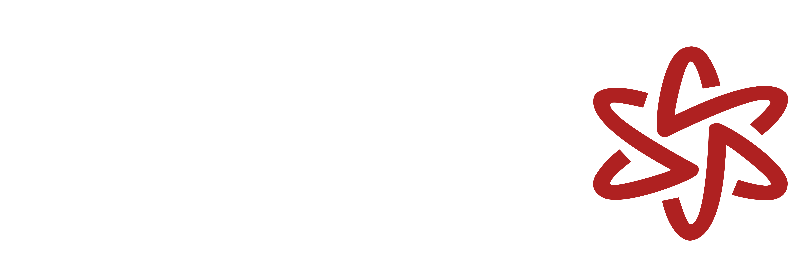

# Chernobyl Roblox Website

<div align="center">
  
</div>

##  Project Overview

A Roblox website project dedicated to the Chernobyl Unit 3 on roblox, showcasing maunal.

###  Technologies Used

<div align="center">
  
  
  
  
  
</div>

##  Features

- Immersive Chernobyl-themed Roblox experience
- Responsive web design
- Bootstrap and Tailwind CSS integration
- Historical content and interactive elements

##  Getting Started

### Prerequisites

- Web browser
- Roblox account
- Basic understanding of web technologies

### Installation

1. Clone the repository
   ```bash
   git clone https://github.com/[YourUsername]/chernobyl-roblox-website.git
   ```

2. Open the project directory
   ```bash
   cd chernobyl-roblox-website
   ```

3. Launch the website using a local server or open `index.html` directly

##  Credits

- **Code Adaptation**: 
  - Original code by Sokirr and Lurmog
  - Adapted by CoreGamer32

- **Community**:
  - Chernobyl Unit 3 Community

##  Support & Feedback

For assistance, bug reports, or suggestions:

- **Discord**: `wilhitematthew`
- **Open an Issue**: [GitHub Issues](https://github.com/[YourUsername]/chernobyl-roblox-website/issues)

##  License

[Specify your license here, e.g., MIT License]

##  Contributions

Contributions are welcome! Please read the [CONTRIBUTING.md](CONTRIBUTING.md) for details on our code of conduct and the process for submitting pull requests.

---

*Disclaimer: This project is a creative interpretation and educational resource about the Chernobyl disaster.*